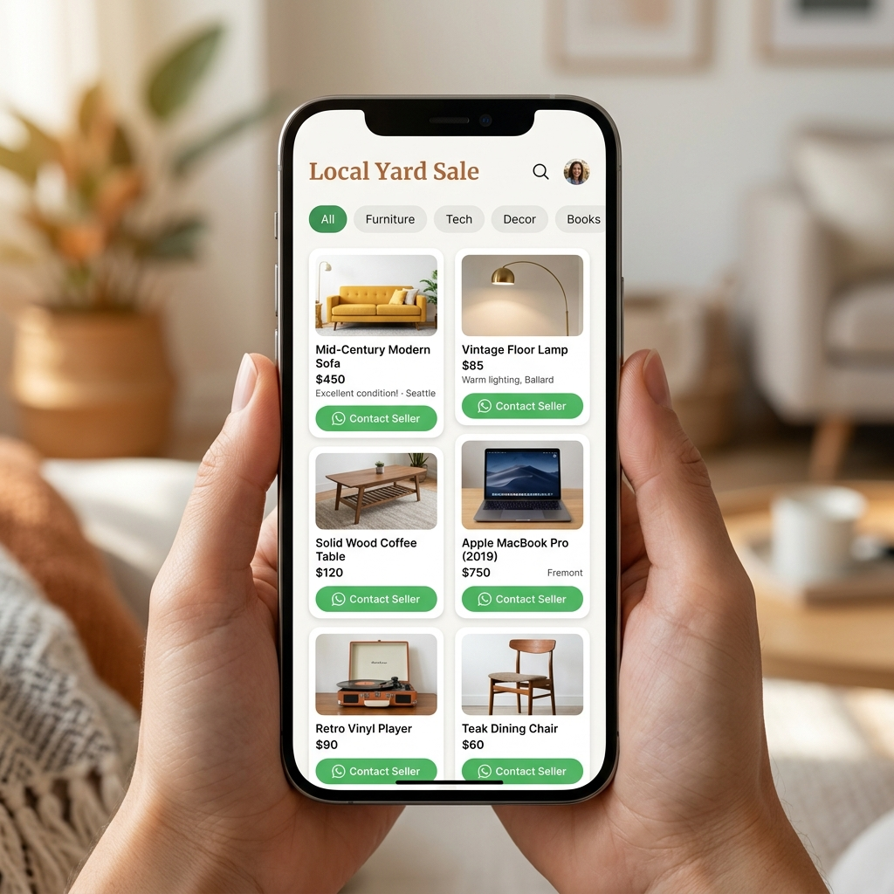
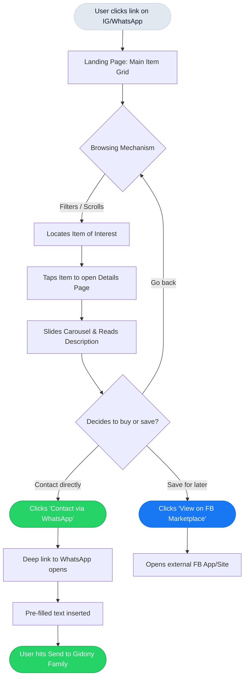

# The Gidony Family Vienna Move - Design Document

> [!NOTE]
> **Project Goal**: Create a single, high-conversion "digital catalog" to sell/giveaway items for the upcoming Vienna move, turning casual browsers into engaged buyers via WhatsApp.

---

## 2. Visual Wireframes & Mockups

### AI-Generated Visual Mockup
Here is a conceptual mockup showcasing the "fresh community vibe", minimalistic aesthetics, soft corners, and prominent WhatsApp CTA that we are aiming for:



### Structural Wireframes (Mobile-First)

````carousel
<!-- slide -->
#### 📱 Homepage / Item Grid
```text
+-----------------------------------+
|  [🏠] The Gidony Yard Sale        |
|  "Next Stop: Vienna ✈️🌍"         |
+-----------------------------------+
| [ All ] [ Furniture ] [ Tech ] 🔎 |
+-----------------------------------+
|  +-----------------------------+  |
|  |     [ Sofa Thumbnail ]      |  |
|  | [🟢 Available]              |  |
|  |                             |  |
|  | Mid-Century Modern Sofa     |  |
|  | ₪250                        |  |
|  +-----------------------------+  |
|                                   |
|  +-----------------------------+  |
|  |  [ Dining Table Image ]     |  |
|  | [🟡 Pending]                |  |
...
```
<!-- slide -->
#### 📱 Selected Item Details
```text
+-----------------------------------+
| < Back           [ Share Item ]   |
+-----------------------------------+
|                                   |
|  [     Gallery/Hero Image    ]    |
|                                   |
+-----------------------------------+
| Mid-Century Modern Sofa           |
| ₪250                              |
|                                   |
| 🟢 Available                      |
|                                   |
| Description:                      |
| We loved this sofa! Bought it in  |
| 2021, pet-free and smoke-free.    |
| Selling because it won't fit in   |
| the new apartment!                |
|                                   |
| Dimensions: 88" W x 32" H x 36" D |
|                                   |
| +-------------------------------+ |
| | [ 📱 Contact via WhatsApp ]   | |
| +-------------------------------+ |
| | [ 💙 View on FB Marketplace ] | |
| +-------------------------------+ |
+-----------------------------------+
```
````

---

## 3. Information Architecture (Item Schema)

To keep friction near zero but still maintain accurate inventory control, our primary data structure will look like this. This can easily be represented in a JSON file or via an API connected to Notion/Google Sheets CMS.

```typescript
type ItemStatus = 'available' | 'pending' | 'sold';

interface YardSaleItem {
  id: string;                 // Unique identifier (e.g., 'itm-001')
  title: string;              // "Solid Wood Dining Table"
  description: string;        // Personal, warm description of the item
  price: number;              // Numeric price (in INS ₪)
  condition: string;          // "Like New", "Good", "Fair"
  category: string;           // "Furniture", "Kitchen", "Tech", "Baby"
  status: ItemStatus;         // Drives visual badges and disabled buttons
  images: string[];           // Array of URLs for full visual transparency
  dimensions?: string;        // Optional real-world constraints
  fbMarketplaceLink?: string; // Optional link to Facebook Marketplace listing
}
```

---

## 4. User Flow Diagram

The core user journey is simple and optimized for "Zero Friction" conversions (direct to WhatsApp).


*Note: Pre-filled WhatsApp URLs handle the template logic: `https://wa.me/YOUR_NUMBER?text=Hi%20Gidony%20family...`*

---

## 5. Visual Style Guide

The "Fresh Community Vibe" balances clean modern layouts with warm, approachable colors.

> [!TIP] 
> **Design Philosophy**
> We avoid harsh blacks (`#000000`) and pure whites (`#FFFFFF`). Instead, we use off-whites to soften contrast and create a warm, tactile feel akin to reading a boutique lifestyle catalog.

### **Color Palette Grid**

| Role | Color Name | Hex Code & Preview | Usage |
| :--- | :--- | :--- | :--- |
| **Background** | Soft Canvas | ⚪ <span style="color:#F9FAF8">██</span> `#F9FAF8` | The absolute background for the entire page body. |
| **Surface** | Card White | ◽ <span style="color:#FEFEFE">██</span> `#FEFEFE` | Background color for item cards (adds a slight lift). |
| **Primary Text** | Rich Slate | ⚫ <span style="color:#2D3748">██</span> `#2D3748` | Headlines, item titles, and standard body copy. |
| **Secondary Text**| Cool Gray | 🔘 <span style="color:#718096">██</span> `#718096` | Dimensions, conditions, descriptive text. |
| **Primary CTA** | WhatsApp Green | 🟢 <span style="color:#25D366">██</span> `#25D366` | The primary contact buttons. |
| **Accent / Badge**| Warm Harvest | 🟠 <span style="color:#F6AD55">██</span> `#F6AD55` | Borders, pending badges, highlight outlines. |

### **Typography Pairings**

* **Headings (`<h1>` - `<h4>`)**: **Outfit**
  * *Reasoning:* A modern, geometric sans-serif that is incredibly friendly and legible. It adds a premium Dribbble-tier "vibe" to the app heading and item titles.
* **Body / UI Elements**: **Inter**
  * *Reasoning:* Specifically tailored for user interfaces. It renders beautifully down to small sizes, ensuring details like price and condition are easily scanned on small mobile screens.

---

## 6. Component Specifications

### 1. The Hero UI (Banner Section)
* **Placement:** Fixed at the top, acting as the primary focal point when landing.
* **Visual Illustration:** We will feature the provided hand-drawn "Yard Sale" banner graphic prominently here.

  

* **Design Rationale:** The vibrant, sketchy aesthetic of this banner (with the red marker text, bright yellow teapot, framed pictures, etc.) perfectly establishes the "fun community event" tone. Using a playful, tactile illustration prevents the UI from feeling too rigid or corporate like an enterprise e-commerce site. 
* **Layout Integration:** The graphic will be centered with a subtle drop shadow to lift it off the `Soft Canvas` background. The rest of the UI (like filter chips and item cards) will remain highly clean and minimalistic—acting as a neutral structural frame so the playful hero graphic can shine without making the page feel visually chaotic.
* **Behavior:** Collapses or scales down smoothly on downward scroll to maximize screen real estate for browsing the grid items.

### 2. Category Filter Bar
* **Placement:** Below the Hero header, sticks to the top (`position: sticky`) upon scrolling.
* **Visuals:** Horizontal flexbox (scrollable on X-axis). "Chips" with soft corners (`border-radius: 9999px`). 
* **Interaction:** Active chip gets a `Rich Slate` background and white text. Inactive chips get transparent backgrounds with a light border.

### 3. The Item Card (Grid View)
* **Image Area:** Occupies the majority of the square card. Displays a single primary thumbnail photo.
* **Status Badge:** Absolute positioned at the top right of the image (`top-3 right-3`), using glassmorphism.
* **Metadata Area:** Simple flex column layout below the image. 
  * Title (`Outfit`, text-sm or text-base).
  * Price (`Inter`, font-semibold, text-lg, in ₪).
* **Interaction:** Tapping the entire card pushes the user to the Details View.

### 4. The Item Details View
* **Image Area:** A seamless carousel allowing left/right swipes to see multiple photos.
* **Content:** Description, condition, and dimensions are cleanly presented.
* **Actions:** Two full-width buttons stacked vertically: Primary `WhatsApp Green` button and Secondary `Facebook Blue` marketplace link.

---

## 7. Tech Stack Recommendation

For an architecture prioritizing rapid momentum, **"zero friction"**, and top-tier user experience, this modern stack is recommended:

* **Framework**: **React + Vite**
  * *Why:* You requested Vite! Vite is an extremely fast frontend build tool providing instant server starts and lightning-fast Hot Module Replacement (HMR). When paired with React, it's perfect for building a snappy, lightweight Single Page Application (SPA) natively suited for mobile browsers.
* **Styling**: **Tailwind CSS**
  * *Why:* Utility-first approach ensures we can rapidly build and tweak the layout to nail the "vibe" without writing bespoke CSS files. 
* **Components / UI**: **Radix UI Primitives** or **shadcn/ui** (customized)
  * *Why:* Pre-built unstyled accessible components (especially for carousels and smooth popovers/tooltips) will save hours while letting us own the design language fully.
* **Icons**: **Lucide React**
  * *Why:* Clean, beautiful, and extensive. Matches the "Outfit" typography geometry perfectly.
* **Image Carousel**: **Embla Carousel**
  * *Why:* Lightweight, buttery smooth touch-action/swiping on mobile devices, and integrates perfectly with React/Tailwind.
* **CMS / Backend**: **Simple `data.json` file** (or basic Firebase/Supabase if live status editing is required).
  * *Why:* Since Vite creates a static SPA, we can simply rely on a predefined `data.json` file for the inventory, making management completely effortless.
* **Deployment (Hosting)**: **Vercel**
  * *Why:* Vercel provides top-tier, zero-configuration support for Vite applications. You get instant push-to-deploy from GitHub, a generous free tier, and blazing fast global edge delivery exactly as you requested.
